# mpv config

Switchable subtitle styles, a subtitle dictionary, a thin [uosc][uosc] interface, and a handful of scripts, all in one dark theme.

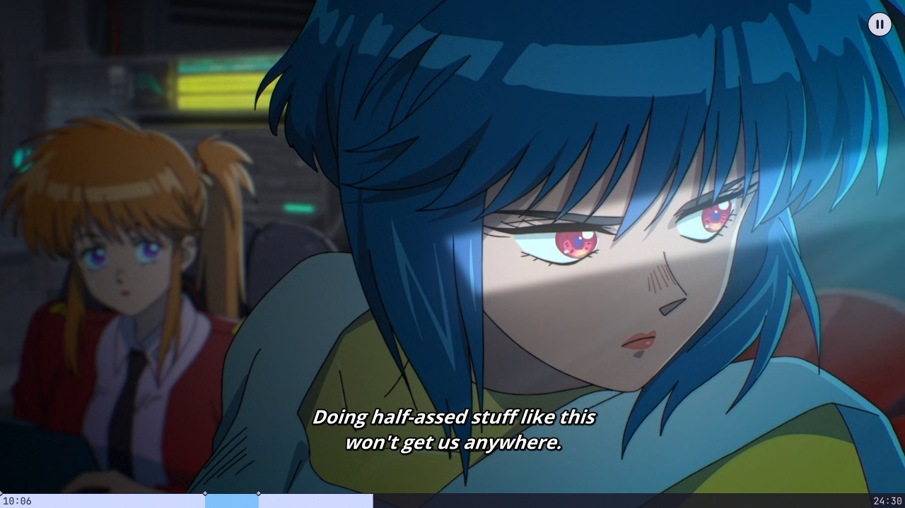

## Install

**[Download mpv-config.zip][download]** and unzip it into your mpv config folder. That's it. Older versions are on the [releases page][releases].

| OS | Folder |
| --- | --- |
| Windows | `%APPDATA%\mpv` |
| Linux / macOS | `~/.config/mpv` |

Press `?` in mpv to see every shortcut.

## Subtitles

Nine styles and seven fonts, flipped through separately. `Alt` + `↑` `↓` changes the style, `Alt` + `←` `→` the font.

| Crunchyroll | Netflix |
| --- | --- |
|  |  |
| **Fansub** (default) | **Retro** |
| 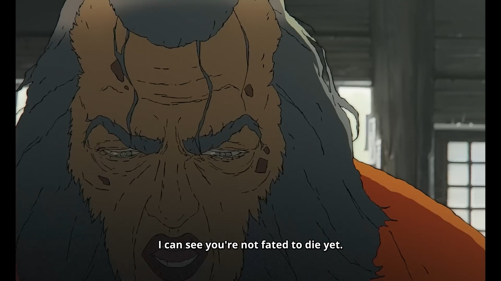 | 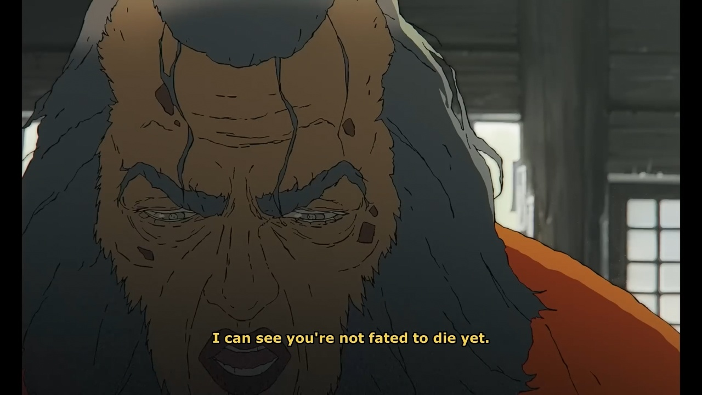 |

| Adjust panel: `Alt` + `a` | Dictionary: `d` |
| --- | --- |
| 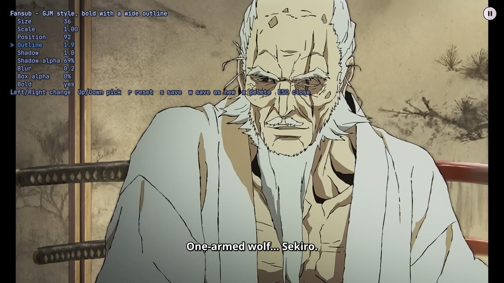 | 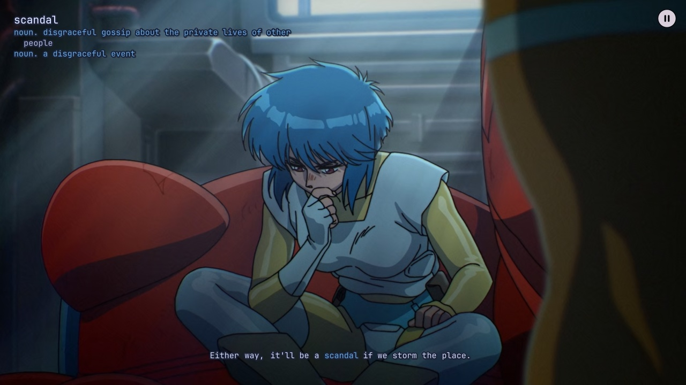 |
| Tweak any style live, then save it or save a new one. | Pauses and looks up the hardest word. Click any other word to look that up instead. Works offline. |

## Interface

| Track picker: `Tab` | Menu: middle-click |
| --- | --- |
| 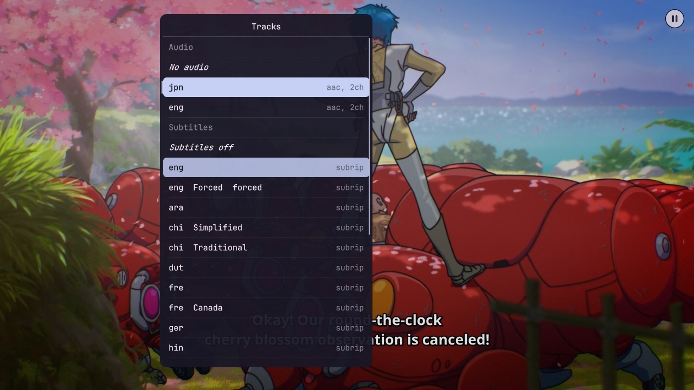 | 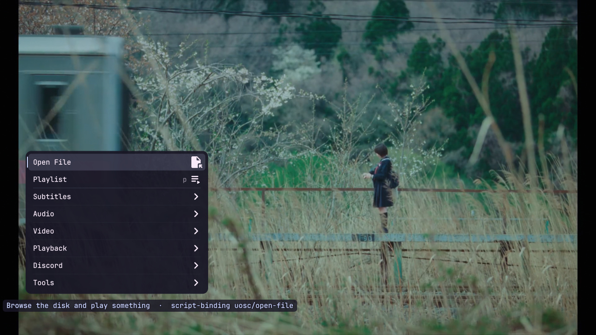 |
| Audio and subtitles in one place. | Opens where the pointer is. |

| Seek bar | Subtitle list: `F4` |
| --- | --- |
| 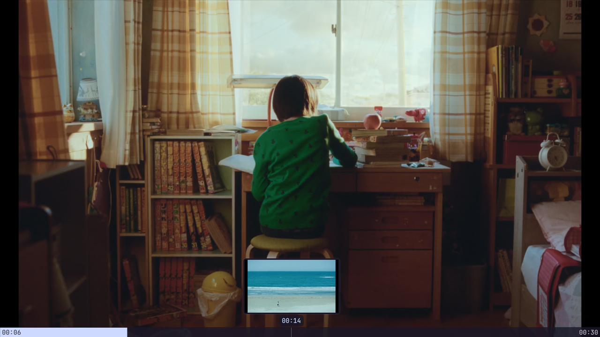 | 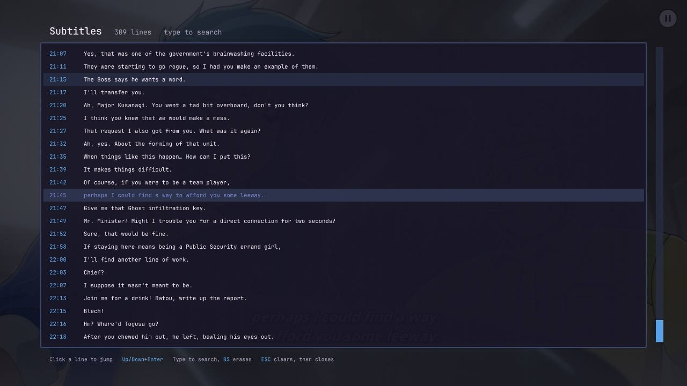 |
| Hover for a thumbnail. Drag to skim. | Every line of the track. Type to search, click to jump. |

## Tools

| Shortcuts: `?` | Clip to WebM: `W` |
| --- | --- |
| 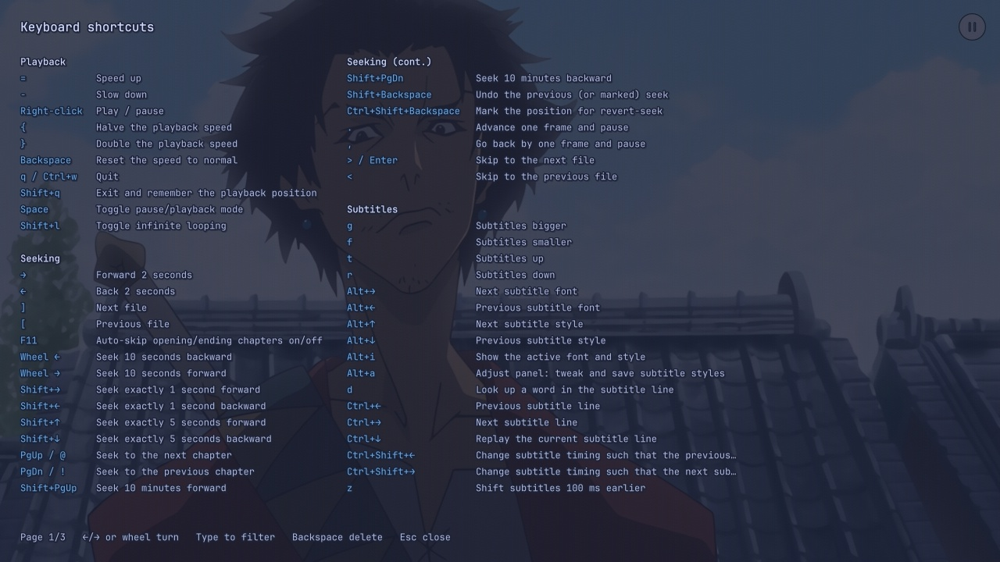 | 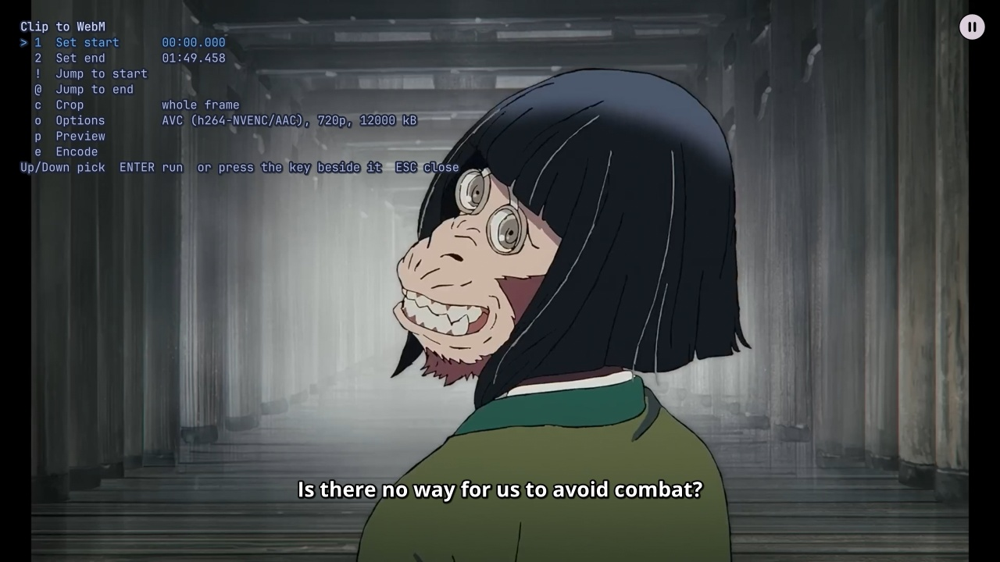 |
| Built from your actual bindings. Type to filter. | Set a start and an end, crop, encode. |

## Discord

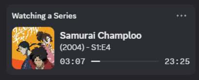

`Alt` + `p` (Windows only) shows what you're watching on your Discord profile, with the poster, year and episode. It works out the show from the filename. `Alt` + `o` re-picks if it guesses wrong. Film posters need a free [TMDB key][tmdb] in a file called `presence-key.txt` next to `mpv.conf`.

## Keys

| Key | Does |
| --- | --- |
| `Right-click` | play / pause |
| `Middle-click` | menu |
| `Tab` | audio and subtitle tracks |
| `p` | playlist |
| `←` `→` | seek 2s |
| `↑` `↓` | volume |
| `=` `-` | speed |
| `[` `]` | previous / next file |
| `g` `f` / `t` `r` | subtitles bigger / smaller / up / down |
| `Ctrl` + `←` `→` | previous / next subtitle line |
| `Ctrl` + `c` | copy the frame to the clipboard |
| `Ctrl` + `r` | reload the file at the same spot |
| `?` | everything else |

## Good to know

- Every video loops. Delete `loop=yes` from `mpv.conf` to stop it.
- Settings for each script are in `script-opts/`.
- Keys are in `input.conf`. The `# comment` after each one is what the `?` sheet shows.
- Netflix Sans isn't included: it's Netflix's own font and can't be shared. If you have it, drop the `.ttf` files into `fonts/`. Without it, the Netflix style falls back to a system font.
- uosc carries a few small local edits. Updating uosc undoes them.

## Credits

- [uosc][uosc] 5.13.0 draws the interface.
- [v-amorim/moonlight-mpv][moonlight]: the theme, menu scripts, subtitle list and several smaller scripts.
- [ento/mpv-cheatsheet][cheatsheet] (MIT): the idea behind the `?` sheet.
- [goodtrailer/mpv-rich-presence][rich-presence] (AGPL-3.0): the Discord plugin, modified. Licence in `licenses/`.

[download]: https://github.com/virakie/mpv/releases/latest/download/mpv-config.zip
[releases]: https://github.com/virakie/mpv/releases
[uosc]: https://github.com/tomasklaen/uosc
[tmdb]: https://www.themoviedb.org/settings/api
[moonlight]: https://github.com/v-amorim/moonlight-mpv
[cheatsheet]: https://github.com/ento/mpv-cheatsheet
[rich-presence]: https://github.com/goodtrailer/mpv-rich-presence
